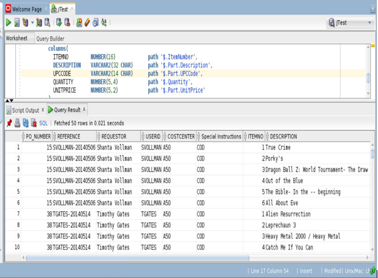
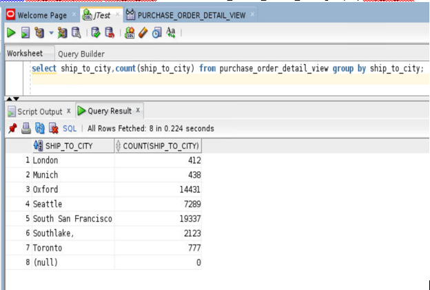
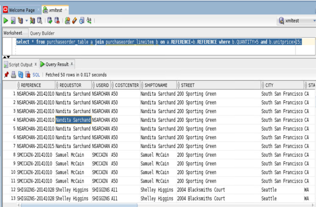
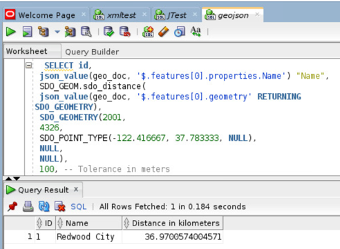

# Oracle Multiple Datatype

## Introduction

This lab will show you how to work with multiple data types in the database.
- JSON with Relational
- XML with Relational
- JSON with Spatial

*Estimated Lab Time:* 20 Minutes

### Prerequisites
This lab assumes you have:
- A Free Tier, Paid or LiveLabs Oracle Cloud account
- You have completed:
    - Lab: Generate SSH Keys
    - Lab: Setup Compute and ADB
    - Lab: Load Data and Start Application

### About Oracle Cross Datatype

JSON_TABLE creates a relational view of JSON data. It maps the result of a JSON data evaluation into relational rows and columns.

The COLUMNS clause evaluates the row source, finds specific JSON values within the row source, and returns those JSON values as SQL values in individual columns of a row of relational data.


## Task 1: Connect to the Pluggable Database (PDB)

1. As oracle user set oracle Environment and connect to the PDB.

    ```
    <copy>
    . oraenv
    </copy>
    ```

    ```
    <copy>
    convergedcdb
    </copy>
    ```

    ```
    <copy>
    sqlplus CRSTYPE/Oracle_4U@APPPDB
    </copy>
    ```

## Task 2: Connect to SQL Developer

1. Make a connection to SQL Developer. Use the details as below and click on connect.


  - **Name**: CROSSTYPE
  - **Username**: CRSTYPE
  - **Password**: `Oracle_4U`
  - **Hostname**: PUBLIC-IP
  - **Port**: 1521
  - **Service name**: APPPDB

    


## Task 3: JSON with Relational

**JSON_TABLE** creates a relational view of JSON data. It maps the result of a JSON data evaluation into relational rows and columns. The COLUMNS clause evaluates the row source, finds specific JSON values within the row source, and returns those JSON values as SQL values in individual columns of a row of relational data

Below are the examples using **JSON_TABLE**.

1. Find all the Products, those sold with payment mode – Cash on Delivery

    ```
    <copy>
    select D.*
      from PURCHASE_ORDER p,
          JSON_TABLE(
            p.PO_DOCUMENT,
            '$'
            columns(
              PO_NUMBER            NUMBER(10)                  path  '$.PONumber',
              REFERENCE            VARCHAR2(30 CHAR)           path  '$.Reference',
              REQUESTOR            VARCHAR2(32 CHAR)           path  '$.Requestor',
              USERID               VARCHAR2(10 CHAR)           path  '$.User',
              COSTCENTER           VARCHAR2(16)                path  '$.CostCenter',
          "Special Instructions" VARCHAR2(4000) PATH '$."Special Instructions"',
              NESTED PATH '$.LineItems[*]'
              columns(
                ITEMNO         NUMBER(16)             path '$.ItemNumber',
                DESCRIPTION    VARCHAR2(32 CHAR)      path '$.Part.Description',
                UPCCODE        VARCHAR2(14 CHAR)      path '$.Part.UPCCode',
                QUANTITY       NUMBER(5,4)            path '$.Quantity',
                UNITPRICE      NUMBER(5,2)            path '$.Part.UnitPrice'
              )
            )
          ) D
    where "Special Instructions"='COD'
    /
    </copy>
    ```

    

2.  Purchase order history count based on City

    ```
    <copy>
    select ship_to_city,count(ship_to_city) from PURCHASE_ORDER_DETAIL_VIEW group by ship_to_city;
    </copy>
    ```
    

## Task 4: XML with Relational

**XMLTABLE:** Convert XML Data into Rows and Columns using SQL. The XMLTABLE operator, which allows you to project columns on to XML data in an XMLTYPE , making it possible to query the data directly from SQL as if it were relational data.

Below are the examples using **XMLTABLE**

1. Customers who ordered quantity of items more than 5 and unit price is greater than $15

    ```
    <copy>
    select * from purchaseorder_table a join purchaseorder_lineitem b on a.REFERENCE=b.REFERENCE where b.QUANTITY>5 and b.unitprice>15;
    </copy>
    ```

    

2. History of customers who ordered for a specific products

    ```
    <copy>
    select * from purchaseorder_table a join purchaseorder_lineitem b on a.REFERENCE=b.REFERENCE where b.DESCRIPTION='Ransom';
    </copy>
    ```

    

## Task 5: JSON with Spatial

GeoJSON Objects: Geometry, Feature, Feature Collection
GeoJSON uses JSON objects that represent various geometrical entities and combinations of these together with user-defined properties.
    - A position is an array of two or more spatial (numerical) coordinates, the first three of which generally represent longitude, latitude, and altitude.
    - A geometry object has a type field and (except for a geometry-collection object) a coordinates field
    - A geometry collection is a geometry object with type GeometryCollection. Instead of a coordinates field it has a geometries field, whose value is an array of geometry objects other than GeometryCollection objects.


1. Compute the distance in KM from specific point to each Geometry. This example selects the documents (there is only one in this table) for which the geometry field of the first features element is within 100 kilometers of a given point. The point is provided literally here (its coordinates are the longitude and latitude of San Francisco, California). The distance is computed from this point to each geometry object. The query orders the selected documents by the calculated distance. The tolerance in meters for the distance calculation is provided in this query as the literal argument 100.


    ```
    <copy>
    SELECT id,json_value(geo_doc, '$.features[0].properties.Name') "Name", SDO_GEOM.sdo_distance(json_value(geo_doc, '$.features[0].geometry' RETURNING SDO_GEOMETRY),SDO_GEOMETRY(2001,4326,SDO_POINT_TYPE(-122.416667, 37.783333, NULL), NULL, NULL), 100, -- Tolerance in meters
    'unit=KM') "Distance in kilometers" FROM json_geo WHERE sdo_within_distance(json_value(geo_doc, '$.features[0].geometry' RETURNING SDO_GEOMETRY),SDO_GEOMETRY(2001,4326,SDO_POINT_TYPE(-122.416667, 37.783333, NULL), NULL, NULL),'distance=100 unit=KM') = 'TRUE';
    </copy>
    ```
    


## Acknowledgements
* **Authors** - Balasubramanian Ramamoorthy, Arvind Bhope
* **Contributors** - Laxmi Amarappanavar, Kanika Sharma, Venkata Bandaru, Ashish Kumar, Priya Dhuriya, Maniselvan K, Robert Ruppel, David Start, Rene Fontcha
* **Last Updated By/Date** - Kay Malcolm, January 2021


